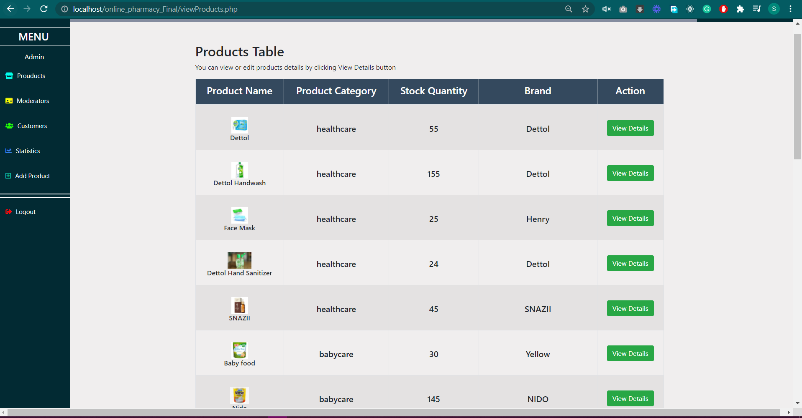

# Glimpse of the Website

    

        
        
    

    

        
        
    

    

        
        
    

    

        
        
    

    

        
        
    

    

        
        
    

    

        
        
    

    

        
        
    

    

        
        
    

Sign-up-page

# Online_Pharmacy
A website where medicine, healthcare and babycare products can be bought online, and many more 
features like upload prescription, online chat, read articles, refund, etc.

In the 9th semester at my university, I took the **System Analysis and Design** course, where
we had given the task to create a website following the SDLC method. I and my group members
developed the website named **Online Pharmacy** that could help people buy medicines and other 
necessary goods online. We designed the website with quite a lot of features and ended up
completing almost all the features that we proposed while designing the website. All the codes
along with the Database (.sql file) of the project is stored in this repository.

## Features of **Online Pharmacy**
1) Buying medicines, babycare and healthcare products.
2) Upload prescription to buy medicines.
3) Read and post healthcare related blogs/articles.
4) Online chat with the moderators.
5) Get reward points on order completion.
6) Get refund for order cancellation.
7) An eWallet for each user.

## Tools we used
1) Front-end: HTML, CSS, JavaScript, Bootstrap.
2) Back-end : PHP, MySQL, XAMPP.
3) Softwares: VS Code.
4) PM Tool  : Freedcamp.
